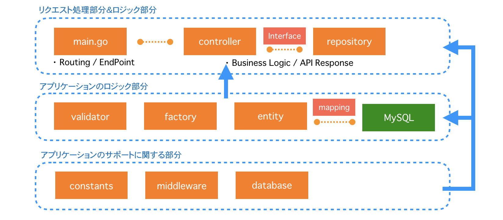

# GolangでのAPI作成のプラクティス用

一応まだ作成中ではありますが、Go言語で(RESTっぽい)APIを書いて見る練習がしたかったので作ってみました。おそらくGo言語っぽさがありましたらPull Requestを頂ければ幸いです。

### このリポジトリの構成

| ファイル or 階層名 | 役割 |
|:---|:---|
|`constants` |どこでも使うような定数値やenumのような形で使いたいものを格納する。 |
|`controllers` |エンドポイントからのリクエスト/レスポンスに関わるものを格納する。 |
|`database` |接続するデータベース(ORMの接続設定やMigraion関連)に関わるものを格納する。<br>`engine.go   (ORMを利用するための処理)`・`dbconf.yaml (マイグレーション実行用)`・`migrations/ (マイグレーションファイル置き場)` |
|`docs` |Swaggerで管理するドキュメントに関わるものを格納する。 |
|`entities` |接続しているテーブルのDBスキーマ定義と構造体を格納する。 |
|`factories` |APIレスポンス形式の雛形となる構造体を格納する。 |
|`middleware` |[機能作成中...]全体もしくは一部の処理で共通して必要な前後処理を割り込ませる。 |
|`repositories` |APIレスポンスを構築するためのロジックに関わるものを格納する。 |
|`static` |HTMLやCSS等の静的ファイルに関わるものを格納する。 |
|`tests` |ValidatorsやRepository等のテストコードを格納する。 |
|`validators` |エンドポイントからControllerに渡された値の妥当性検証に関わるものを格納する。 |
|`vendor` |インストールしたパッケージを格納する。 |
|`Gopkg.lock`<br>`Gopkg.toml` |パッケージの依存関係を管理する。 |
|`main.go` |主にここではエンドポイントの管理を担当している。 |

大雑把な処理の流れは下記のような流れになります。

```
処理順1. controllerでリクエストを受け取ってvalidatorで妥当性を検証する。
処理順2. 1.が妥当であればcontrollerに対応するrepositoriesの処理(Interfaceを定義すること!)を実行する。
処理順3. 2.ではMySQLからentityで定義した形のデータを取得する等のロジックに関わる処理を行いfactoryで定義したデータを作成する。
処理順4. 3.の処理結果に応じてfactoryで定義した形のレスポンスを返却する。
```

### アーキテクチャの参考

下記のブログ記事を参考にそれぞれのディレクトリ構成を作成しました。

__関係図:__



__参考:__

+ [バーガーショップで例えるオールアバウトでのLaravelアーキテクチャ](https://allabout-tech.hatenablog.com/entry/2016/11/29/100000)

### Go言語標準以外のパッケージ

現在は下記のGo言語のパッケージを用いて開発しています。
ロジックの構築に加えて運用保守に関わるもの等、便利そうなものは随時導入していく予定です。

__1. API構築に関わるもの__

| パッケージ名 | 用途 |
|:---|:---|
|[Gin](https://github.com/gin-gonic/gin) |APIのルーティング管理 |
|[xorm](https://github.com/go-xorm/xorm) |MySQLでのデータ取得用のORM<br>参考: [GinでORM(xorm)を使ってみる](http://suga-tech3.hatenablog.com/entry/2016/09/08/184831) |
|[bcrypt](https://gowebexamples.com/password-hashing/) |パスワードのハッシュ化<br>参考: [【Go言語】パスワードをハッシュ化(bcrypt)](http://blog.motikan2010.com/entry/2017/02/13/%E3%80%90Go%E8%A8%80%E8%AA%9E%E3%80%91%E3%83%91%E3%82%B9%E3%83%AF%E3%83%BC%E3%83%89%E3%82%92%E3%83%8F%E3%83%83%E3%82%B7%E3%83%A5%E5%8C%96%28bcrypt%29) |

__2. 運用保守に関わるもの__

| パッケージ名 | 用途 |
|:---|:---|
|[dep](https://github.com/golang/dep)|パッケージの依存関係管理ツール |
|[goose](https://github.com/pressly/goose) |MySQLのDBマイグレーションツール |
|[swag](https://github.com/swaggo/swag)<br>[gin-swagger](https://github.com/swaggo/gin-swagger)<br>[gin-swagger/swaggerFiles](https://github.com/swaggo/gin-swagger/swaggerFiles)<br>[go.uuid](go.uuid) |Ginを利用した構成でGodocからSwaggerによるAPI定義書の書き出し |

### 事前準備と補足

※ 以降は少なくともGo言語とMySQLがインストールされていることを前提としています。

__1. パッケージの取得:__

導入していないパッケージがある場合は下記のコマンドにて導入をしておく。

```
新規追加時:
$ dep ensure -add (パッケージ名)

更新時:
$ dep ensure -update (パッケージ名)
```

参考:

+ [依存関係管理ツールdep(golang)](https://qiita.com/Azizjan/items/66564b5dc7597717932b)
+ [Goオフィシャルチーム作成の依存関係管理ツールdepを試してみた](https://dev.classmethod.jp/go/dep/)

※ パッケージ管理ツール`dep`を使用しない場合:

導入していないパッケージがある場合は下記のコマンドにて導入をしておく。

```
$ go get -u (パッケージ名)
```

__2. DB定義のマイグレーション:__

DB構造の変更や追加がある際は下記のコマンドをGooseのREADME等を参考にし、実行するSQLを作成した後にマイグレーションを実行すること。

1. イメージとしてはRailsの`rake db:migrate`と似たようなことをする。
2. `-path "database"`としているのは`dbconf.yaml`の場所がデフォルトと異なるため。

```
$ goose -path "database" (実行したい命令)
```

参考:

+ [Golang製DBマイグレーションツールgoose + MySQLを試してみた](https://qiita.com/K_ichi/items/b9362e3a3c5688e494e2)
+ [gooseによるテーブルマイグレーション管理](http://engineering.enish.jp/?p=994&doing_wp_cron=1526793213.5329029560089111328125)
+ [golang製のDBマイグレーションツールgooseをMySQLで使ってみる](http://shusatoo.net/programming/golang/goose-mysql-migration/)

__3. API定義書の自動書き出し:__

APIの処理を新たに作成した場合にはコメントにAPI定義を記載しておく。
記載が終わったら下記のコマンドを実行し、API定義書を更新する。

参考:

+ [[swaggo]GoのGoDocを書いたら、Swaggerを出せるやばいやつ](https://qiita.com/pei0804/items/3a0b481d1e47e5a72078)
+ [swaggoが思いの外、素晴らしかった](https://syossan.hateblo.jp/entry/2018/05/15/175653)

```
$ swag init
$ go run main.go
```

起動ができたら下記のURLから、SwaggerUIと照らし合わせて、定義書と挙動が問題ないことを確認しておく。

+ [チェック!](http://localhost:8080/swagger/index.html)

__4. その他気になったメモ集:__

参考: 自分の環境で利用しているのはMySQL5.6系をローカルにインストールして利用しています。

+ [MySQL5.6をHomebrewでmacOSにインストールする手順](https://weblabo.oscasierra.net/mysql-56-homebrew-install/)

参考: MySQLが起動できなかったので、再度`$ brew ...`でMySQLをアンインストール→インストールを行なった際に下記の情報で解決はできた。

+ [mysqlが起動できない](https://qiita.com/hondy12345/items/d32ed749fb49e9da7de6)
+ [ERROR 2002 (HY000): Can't connect to local MySQL server through socket '/tmp/mysql.sock' (38)](https://sankame.github.io/blog/2017-11-20-fail_to_connect_mysql/)

※ 開発環境であっても`root`ユーザーにパスワードにもパスワードを設定しておくと良いと思います。（本来はDockerにすべきなんだが...）

+ [SQLユーザー要注意！意外と知らないMySQLのrootパスワード設定方法](https://blog.codecamp.jp/root-password)
